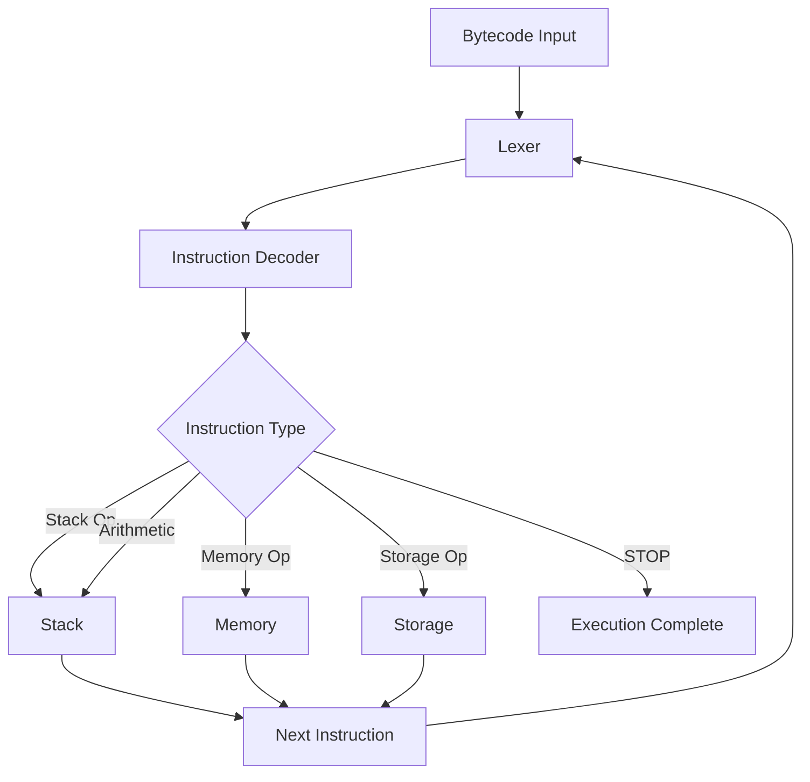

## Overview

Cubipods uses a **sequential execution model** where bytecode is read and executed one instruction at a time. The VM maintains state across four main components: the Lexer, Stack, Memory, and Storage.

## Execution Flow



## Step-by-Step Execution

Let's trace the execution of `6003600201` (3 + 2):

<Steps>
  <Step title="Initialization">
    Create VM with bytecode and initialize components:
    
    ```rust
    // From src/vm.rs:29-35
    pub fn new(bytecode: &'a str, verbose: bool) -> Result<Self, Box<dyn Error>> {
        Ok(Self {
            lexer: Lexer::new(bytecode)?,
            verbose,
            ..Default::default()
        })
    }
    ```
    
    State:
    - Stack: `[]`
    - Lexer position: 0
    - Memory: empty
    - Storage: empty
  </Step>

  <Step title="Read First Byte (0x60)">
    The lexer reads two characters forming byte `0x60`:
    
    ```rust
    // From src/lexer.rs:40-58
    pub fn next_byte(&mut self) -> Result<String, Box<dyn Error>> {
        let first_nibble = self.ch;
        self.read_char();
        let second_nibble = self.ch;
        // ... validation
        self.read_char();
        Ok(format!("{first_nibble}{second_nibble}"))
    }
    ```
    
    Result: `"60"` → Decoded as PUSH1
  </Step>

  <Step title="Execute PUSH1 (read data)">
    PUSH1 needs 1 data byte, so read the next byte:
    
    ```rust
    // From src/vm.rs:65-85
    InstructionType::PUSH(size) => {
        let mut counter = 0;
        let mut data = "".to_string();
        while counter < size {
            data += &self.lexer.next_byte()?;
            counter += 1;
        }
        let index = self.stack.push(data.clone())?;
        // ...
    }
    ```
    
    - Read `0x03`
    - Push `"03"` to stack
    
    State:
    - Stack: `["03"]`
    - Lexer position: 4 (read "6003")
  </Step>

  <Step title="Read Second Byte (0x60)">
    Read next byte pair:
    
    Result: `"60"` → Another PUSH1
  </Step>

  <Step title="Execute Second PUSH1">
    - Read data byte `0x02`
    - Push `"02"` to stack
    
    State:
    - Stack: `["03", "02"]` (top is "02")
    - Lexer position: 8 (read "60036002")
  </Step>

  <Step title="Read Third Byte (0x01)">
    Read next byte pair:
    
    Result: `"01"` → ADD instruction
  </Step>

  <Step title="Execute ADD">
    Pop two values, add them, push result:
    
    ```rust
    // From src/vm.rs:146-152
    InstructionType::ADD => {
        let (item_1, item_2) = *build_initials()?.downcast::<(Bytes32, Bytes32)>().unwrap();
        let result = item_1 + item_2;
        self.stack.push(result.parse_and_trim()?)?;
    }
    ```
    
    - Pop `"02"` and `"03"` from stack
    - Add: 2 + 3 = 5
    - Push `"05"` to stack
    
    State:
    - Stack: `["05"]`
    - Lexer position: 10 (end of bytecode)
  </Step>

  <Step title="Termination">
    Lexer character is `'\0'`, exit main loop:
    
    ```rust
    // From src/vm.rs:40
    'main: while self.lexer.ch != '\0' {
        // ...
    }
    ```
    
    Execution complete!
  </Step>
</Steps>

## State Management

### Stack Operations

The stack follows Last-In-First-Out (LIFO) order:

```rust
// From src/stack.rs:35-62
pub fn pop(&mut self) -> Result<(usize, T), StackError> {
    if let Some(head) = self.head.take() {
        self.length -= 1;
        self.head = head.prev;
        Ok((1, head.item))
    } else {
        Err(StackError::StackUnderflow)
    }
}

pub fn push(&mut self, item: T) -> Result<usize, StackError> {
    if self.length == STACK_SIZE_LIMIT {
        return Err(StackError::StackOverflow);
    }
    self.length += 1;
    let index = (self.length - 1) as usize;
    let stack_node = StackNode::new(item, self.head.take());
    self.head = Some(Box::new(stack_node));
    Ok(index)
}
```

### Memory Expansion

Memory automatically expands when accessed:

```rust
// From src/memory.rs:50-61
pub unsafe fn mstore(&mut self, location: Bytes32, data: Bytes32) {
    let location: usize = location.try_into().unwrap();
    let extended_location = location + 32;

    if extended_location > self.heap.len() {
        self.extend(extended_location - self.heap.len());
    }

    let ptr = self.heap.as_mut_ptr().add(location) as *mut [u8; 32];
    *ptr = data.0;
}
```

### Storage Updates

Storage uses a HashMap for instant lookups:

```rust
// From src/storage.rs:17-23
pub fn sstore(&mut self, slot: Bytes32, value: Bytes32) {
    self.storage.insert(slot, value);
}

pub fn sload(&self, slot: Bytes32) -> Option<&Bytes32> {
    self.storage.get(&slot)
}
```

## Instruction Dispatch

The main execution loop uses pattern matching:

```rust
// From src/vm.rs:144-344
match instruction {
    InstructionType::STOP => break 'main,
    InstructionType::ADD => {
        let (item_1, item_2) = *build_initials()?.downcast::<(Bytes32, Bytes32)>().unwrap();
        let result = item_1 + item_2;
        self.stack.push(result.parse_and_trim()?)?;
    }
    InstructionType::MUL => {
        // ... multiply operation
    }
    InstructionType::MSTORE => unsafe {
        let (item_1, item_2) = *build_initials()?.downcast::<(Bytes32, Bytes32)>().unwrap();
        self.memory.mstore(item_1, item_2);
    },
    // ... more instructions
}
```

## Verbose Mode

Enable verbose mode to see execution history:

```bash
cubipods -b 6003600201 -v
```

This tracks every operation:

```rust
// From src/main.rs:6-19
fn main() -> Result<(), Box<dyn Error>> {
    let args = Args::parse();
    let mut vm = args.build()?;
    
    vm.run()?;

    if vm.verbose {
        vm.history.summarize();
        vm.history.analyze(&vm);
    }

    Ok(())
}
```

Output includes:
- Each instruction executed
- Stack state changes
- Memory operations with addresses
- Storage operations with slots
- Final state of all components

## Error Handling

Execution can fail at several points:

### Lexer Errors

```rust
// From src/utils/errors.rs
pub enum LexerError {
    HasWhitespace,
    EmptyChar,
    InvalidNibble,
    UnableToCreateLexer,
}
```

Example: Invalid hex character
```bash
cubipods -b 0xZZZZ
# Error: InvalidNibble
```

### Stack Errors

```rust
pub enum StackError {
    StackUnderflow,     // Pop from empty stack
    StackOverflow,      // Exceed 1024 elements
    StackSizeExceeded,  // DUP/SWAP index out of bounds
    WrongIndex,         // SWAP with index 0
    StackIsEmpty,
}
```

Example: Stack underflow
```bash
cubipods -b 01  # ADD with empty stack
# Error: ShallowStack
```

### VM Errors

```rust
pub enum VmError {
    ShallowStack(&'static InstructionType),
    IncompatibleSize(InstructionType),
}
```

Example: Invalid PUSH size
```bash
# PUSH33 doesn't exist (max is PUSH32)
# Would trigger IncompatibleSize error
```

## Performance Characteristics

| Operation | Time Complexity | Notes |
|-----------|----------------|-------|
| Stack push/pop | O(1) | Linked list |
| Stack peek | O(1) | Access head |
| Stack dup/swap | O(n) | Traverse to index |
| Memory read/write | O(1) | Direct indexing |
| Memory expand | O(n) | Allocate new bytes |
| Storage read/write | O(1) avg | HashMap |
| Lexer next byte | O(1) | Sequential read |

<Info>
Cubipods prioritizes correctness and simplicity over performance optimization.
</Info>

## Next Steps

<CardGroup cols={2}>
  <Card title="EVM Basics" icon="book" href="/concepts/evm-basics">
    Understand EVM architecture
  </Card>
  <Card title="Bytecode Format" icon="binary" href="/concepts/bytecode">
    Learn to read and write bytecode
  </Card>
  <Card title="Opcodes" icon="microchip" href="/opcodes/overview">
    Explore all supported operations
  </Card>
  <Card title="API Reference" icon="code" href="/api/vm">
    Use Cubipods programmatically
  </Card>
</CardGroup>
